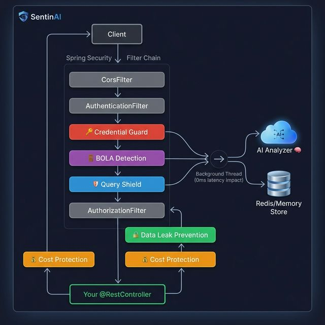

# SentinAI

**AI-Powered API Security for Spring Boot — Just Add a Dependency.**

SentinAI is a Spring Boot Starter that protects your APIs using AI-driven threat detection. It catches attacks that static WAFs and rate limiters miss — credential stuffing, application-layer DDoS, data leaks, and authorization bypasses.

---

## Architecture



> SentinAI sits **inside** Spring Security's filter chain — not as a separate gateway. It runs **after** authentication so it knows who the user is.

### Performance Impact

| Operation | Latency Added |
|:---|:---|
| Blacklist check (Redis/Memory) | ~1ms |
| Regex pattern matching | ~0.1ms |
| BOLA ID tracking | ~0.5ms |
| DLP response scan | ~2-5ms |
| **Total sync overhead** | **~3-7ms** |
| AI analysis (async) | **0ms** *(background thread)* |

---

## Quick Start

### 1. Add Dependency
```xml
<dependency>
    <groupId>com.sentinai</groupId>
    <artifactId>sentinai-spring-boot-starter</artifactId>
    <version>1.0.0-SNAPSHOT</version>
</dependency>
```

### 2. Set API Key
```yaml
sentinai:
  ai:
    api-key: ${AI_API_KEY}
```

### 3. Done.
SentinAI starts in **MONITOR mode** — logs threats but doesn't block. Review logs, then switch to `ACTIVE`.

```
[SentinAI] Starting in MONITOR mode
[SentinAI] Loaded: credential-guard, query-shield, data-leak-prevention, cost-protection, bola-detection
[SentinAI] ⚠️ WOULD HAVE BLOCKED 1.2.3.4 — credential stuffing (92% confidence)
[SentinAI] ⚠️ Response to GET /api/users/5 contains password hash — WOULD HAVE REDACTED
```

---

## Features

| Module | Problem | Auto-Enabled | Docs |
|:---|:---|:---|:---|
| 🔑 **Credential Guard** | Slow-burn brute force attacks | ✅ | [docs/credential-guard.md](docs/credential-guard.md) |
| 🛡️ **Query Shield** | App-layer DDoS via expensive queries | ✅ | [docs/query-shield.md](docs/query-shield.md) |
| 🔒 **Data Leak Prevention** | Passwords, SSNs, API keys in responses | ✅ | [docs/data-leak-prevention.md](docs/data-leak-prevention.md) |
| 💰 **Cost Protection** | AI API bill shock | ⚙️ Needs budget | [docs/cost-protection.md](docs/cost-protection.md) |
| 🚪 **BOLA Detection** | Users accessing other users' data | ⚙️ Needs config | [docs/bola-detection.md](docs/bola-detection.md) |

---

## Full Configuration

```yaml
sentinai:
  enabled: true
  mode: MONITOR              # MONITOR or ACTIVE
  ai:
    provider: openai
    api-key: ${AI_API_KEY}
    model: moonshotai/kimi-k2-instruct
    base-url: https://integrate.api.nvidia.com
  store:
    type: in-memory           # in-memory or redis
    redis-url: redis://localhost:6379
  modules:
    credential-guard:
      enabled: true
    query-shield:
      enabled: true
    data-leak-prevention:
      enabled: true
      config:
        mode: REDACT          # LOG, REDACT, or BLOCK
    cost-protection:
      enabled: true
      config:
        daily-limit: 50
        per-user-limit: 100
    bola-detection:
      enabled: true
      config:
        unique-id-threshold: 15
        sequential-threshold: 5
```

---

## Custom Module

```java
@Component
public class CouponFraudDetector implements SecurityModule {

    @Override
    public String getId() { return "coupon-fraud"; }

    @Override
    public String getName() { return "Coupon Fraud Detector"; }

    @Override
    public ThreatVerdict analyzeRequest(RequestEvent event, ModuleContext ctx) {
        // Your detection logic — runs synchronously (keep it fast!)
        return ThreatVerdict.safe(getId());
    }
}
```

SentinAI auto-discovers any `@Component` implementing `SecurityModule`.

---

## Tech Stack

- **Java 17+** / **Spring Boot 3.4+**
- **Spring Security** filter chain integration
- **Spring AI** (OpenAI-compatible — Kimi, Nvidia NIM, Ollama)
- **Redis** (production) or **In-Memory** (development)
