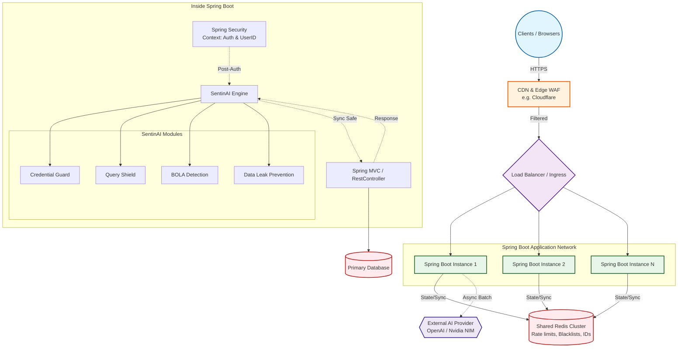

# SentinAI

**AI-Powered API Security for Spring Boot — Just Add a Dependency.**

[](https://central.sonatype.com/artifact/io.github.tapeshchavle/sentinai-spring-boot-starter)
[](https://adoptium.net)
[](https://spring.io/projects/spring-boot)
[](https://opensource.org/licenses/MIT)

---

## 🛑 The Problem: What Existed Before
If you've ever deployed an API to production, you've probably put it behind an API Gateway or a Web Application Firewall (WAF) like Cloudflare, AWS WAF, or Nginx. 

**Here's the problem with traditional WAFs:**
They sit *outside* your application. They look at HTTP traffic (headers, IPs, raw payloads) but they have absolutely zero context about your business logic or who the user actually is. 

- A WAF sees: `GET /api/users/5 (IP: 192.168.1.10) (Token: eyJhbGci...)`
- Your App sees: `GET /api/users/5 (User: Alice)`

Because WAFs are blind to app context, attackers easily bypass them:
1. **Distributed Credential Stuffing:** Attackers use millions of rotating proxy IPs to try leaked passwords. An IP-based rate limiter will never trigger because each IP only makes one request.
2. **Broken Object Level Authorization (BOLA/IDOR):** An authenticated user changes `/api/receipts/1` to `/api/receipts/2`. Both requests look perfectly legitimate to a WAF, so it lets them through.
3. **Application-Layer DDoS:** Attackers send legitimate-looking but complex database queries (like heavy search wildcards). WAFs see valid JSON and allow it; your database chokes and dies.

## 💡 The Solution: SentinAI
Instead of trying to secure your app from the outside, **SentinAI sits *inside* your Spring Boot application**, right inside the Spring Security filter chain. 

By operating post-authentication, SentinAI knows exactly *who* the user is, not just their IP address. It runs lightweight synchronous heuristics to catch immediate threats (like regex patterns or concurrency limits) and uses asynchronous AI analysis via LLMs (OpenAI, DeepSeek, Nvidia NIM) to catch complex behavioral anomalies like BOLA and slow-burn credential stuffing.

---

## 🏗️ Architecture

SentinAI is designed for modern, scalable, distributed architectures. 

When your application is deployed across multiple instances (e.g., in Kubernetes or behind an AWS Application Load Balancer), SentinAI uses a shared **Redis Cluster** to keep track of state. If an attacker tries a password on Instance A, Instance B instantly knows about it.



### How the Flow Works:
1. **Edge:** Traffic hits your CDN/WAF. Basic attacks (bad IPs, malformed headers) are dropped here.
2. **Ingress:** Traffic is routed through your Load Balancer to one of your Spring Boot instances.
3. **Spring Security:** The app authenticates the user. We now know their identity (e.g., `userId: 1045`).
4. **SentinAI Engine:** Before hitting the Controller, SentinAI intercepts the request. 
   - It checks the **Shared Redis Cluster** to see if this user/IP/fingerprint is globally blocked across your fleet.
   - It runs synchronous, low-latency checks (like regex scanning or circuit breakers).
5. **Controller:** If safe, the request hits your actual `@RestController` and database.
6. **Response Phase:** SentinAI intercepts the outbound response to scan for leaked data (like SSNs or API keys) before it goes back to the client.
7. **Async AI:** In the background, SentinAI batches request metadata and sends it to your **External AI Provider** for deep behavioral analysis. If the AI detects an anomaly, it writes a block command to Redis, protecting all instances instantly.

### Performance Impact
SentinAI is built to be fast. The heavy AI lifting is done completely asynchronously.

| Operation | Latency Added |
|:---|:---|
| Blacklist check (Redis) | ~1ms |
| Regex pattern matching | ~0.1ms |
| DLP response scan | ~2-5ms |
| **Total sync overhead** | **~3-7ms** |
| AI analysis (async) | **0ms** *(background thread)* |

---

## 🚀 Quick Start

### 1. Add the Dependency

SentinAI is available on **Maven Central**.

**Maven:**
```xml
<dependency>
    <groupId>io.github.tapeshchavle</groupId>
    <artifactId>sentinai-spring-boot-starter</artifactId>
    <version>1.0.0</version>
</dependency>
```

**Gradle:**
```groovy
implementation 'io.github.tapeshchavle:sentinai-spring-boot-starter:1.0.0'
```

### 2. Set your API Key
Add this to your `application.yml` or `application.properties`:

```yaml
sentinai:
  ai:
    api-key: ${AI_API_KEY}
```

### 3. You're Done.
SentinAI starts in **MONITOR mode** by default. It will log threats but it won't actually block any of your users. Once you are comfortable with what it's catching, just change the mode to `ACTIVE`.

```
[SentinAI] Starting in MONITOR mode
[SentinAI] Loaded: credential-guard, query-shield, data-leak-prevention, cost-protection, bola-detection
[SentinAI] ⚠️ WOULD HAVE BLOCKED 1.2.3.4 — credential stuffing (92% confidence)
[SentinAI] ⚠️ Response to GET /api/users/5 contains password hash — WOULD HAVE REDACTED
```

---

## 🛡️ The Modules

| Module | The Problem it Solves | Docs |
|:---|:---|:---|
| 🔑 **Credential Guard** | Distributed, slow-burn credential stuffing attacks that bypass IP rate limits. | [Read More](docs/credential-guard.md) |
| 🛡️ **Query Shield** | Application-layer DDoS attacks that crash databases via expensive queries. | [Read More](docs/query-shield.md) |
| 🔒 **Data Leak Prevention** | Accidental exposure of PII, SSNs, and API keys in outbound JSON responses. | [Read More](docs/data-leak-prevention.md) |
| 💰 **Cost Protection** | Bad actors running up massive LLM token bills on your AI integrations. | [Read More](docs/cost-protection.md) |
| 🚪 **BOLA Detection** | Users manipulating resource IDs in URLs to access data that doesn't belong to them. | [Read More](docs/bola-detection.md) |

---

## ⚙️ Full Configuration example

```yaml
sentinai:
  enabled: true
  mode: MONITOR              # Change to ACTIVE to actually block threats
  ai:
    provider: openai
    api-key: ${AI_API_KEY}
    model: moonshotai/kimi-k2-instruct # Customizable
    base-url: https://integrate.api.nvidia.com
  store:
    type: redis               # Highly recommended for multi-instance deployments
    redis-url: redis://localhost:6379 
  modules:
    credential-guard:
      enabled: true
    query-shield:
      enabled: true
    data-leak-prevention:
      enabled: true
      config:
        mode: REDACT          # LOG, REDACT, or BLOCK
    cost-protection:
      enabled: true
      config:
        daily-limit: 50
        per-user-limit: 100
    bola-detection:
      enabled: true
      config:
        unique-id-threshold: 15
        sequential-threshold: 5
```

---

## 🛠️ Extending it: Custom Modules
Building your own security check is incredibly easy. Just implement the `SecurityModule` interface and annotate it with `@Component`. SentinAI will automatically discover it and slot it into the processing pipeline.

```java
@Component
public class CouponFraudDetector implements SecurityModule {

    @Override
    public String getId() { return "coupon-fraud"; }

    @Override
    public String getName() { return "Coupon Fraud Detector"; }

    @Override
    public ThreatVerdict analyzeRequest(RequestEvent event, ModuleContext ctx) {
        // Your bespoke detection logic.
        // E.g., check if the user is applying too many coupons too quickly.
        return ThreatVerdict.safe(getId());
    }
}
```

---

## 📦 Maven Central Artifacts

We publish in a modular format. You can pull in the starter to get everything, or pick and choose specific modules to keep your application size down.

| Artifact | Purpose |
|:---|:---|
| `sentinai-spring-boot-starter` | ⭐ **Use this.** It automatically pulls in the core and all bundled modules. |
| `sentinai-core` | The base engine and plugin system if you just want to write your own modules. |
| `sentinai-module-[name]` | Individual threat detection modules. |

Browse all artifacts on Maven Central: [search.maven.org](https://search.maven.org/search?q=g:io.github.tapeshchavle)

---

## 📄 License

Distributed under the MIT License. See [LICENSE](LICENSE) for more information.
