# SentinAI

**AI-Powered API Security for Spring Boot — Just Add a Dependency.**

[](https://central.sonatype.com/artifact/io.github.tapeshchavle/sentinai-spring-boot-starter)
[](https://adoptium.net)
[](https://spring.io/projects/spring-boot)
[](https://opensource.org/licenses/MIT)

---

## 🛑 The Problem: What Existed Before
If you've ever deployed an API to production, you've probably put it behind an API Gateway or a Web Application Firewall (WAF) like Cloudflare, AWS WAF, or Nginx. 

**Here's the problem with traditional WAFs:**
They sit *outside* your application. They look at HTTP traffic (headers, IPs, raw payloads) but they have absolutely zero context about your business logic or who the user actually is. 

- A WAF sees: `GET /api/users/5 (IP: 192.168.1.10) (Token: eyJhbGci...)`
- Your App sees: `GET /api/users/5 (User: Alice)`

Because WAFs are blind to app context, attackers easily bypass them:
1. **Distributed Credential Stuffing:** Attackers use millions of rotating proxy IPs to try leaked passwords. An IP-based rate limiter will never trigger because each IP only makes one request.
2. **Broken Object Level Authorization (BOLA/IDOR):** An authenticated user changes `/api/receipts/1` to `/api/receipts/2`. Both requests look perfectly legitimate to a WAF, so it lets them through.
3. **Application-Layer DDoS:** Attackers send legitimate-looking but complex database queries (like heavy search wildcards). WAFs see valid JSON and allow it; your database chokes and dies.

## 💡 The Solution: SentinAI
Instead of trying to secure your app from the outside, **SentinAI sits *inside* your Spring Boot application**, right inside the Spring Security filter chain. 

By operating post-authentication, SentinAI knows exactly *who* the user is, not just their IP address. It runs lightweight synchronous heuristics to catch immediate threats (like regex patterns or concurrency limits) and uses asynchronous AI analysis via LLMs (OpenAI, DeepSeek, Nvidia NIM) to catch complex behavioral anomalies like BOLA and slow-burn credential stuffing.

---

## 🏗️ How It Works: Scalable Microservice Architecture

SentinAI is designed for modern, scalable, distributed architectures. Rather than burying security inside individual microservices, SentinAI drops perfectly into your **Spring Cloud Gateway** — acting as a centralized, intelligent load balancer and ingress controller. It protects all your downstream microservices at the organizational boundary, while integrating with a shared Redis cluster to synchronize threat intelligence.

```mermaid
graph TD
    classDef default fill:#2b2b2b,stroke:#555,stroke-width:1px,color:#fff;
    classDef client fill:#1e1e1e,stroke:#0288d1,stroke-width:2px,color:#fff;
    classDef gateway fill:#1a1a1a,stroke:#f57c00,stroke-width:2px,color:#fff;
    classDef app fill:#1a1a1a,stroke:#388e3c,stroke-width:2px,color:#fff;
    classDef moduleRed fill:#b71c1c,stroke:#ff5252,stroke-width:1px,color:#fff;
    classDef moduleBlue fill:#0d47a1,stroke:#448aff,stroke-width:1px,color:#fff;
    classDef modulePurple fill:#4a148c,stroke:#e040fb,stroke-width:1px,color:#fff;
    classDef moduleGreen fill:#1b5e20,stroke:#69f0ae,stroke-width:1px,color:#fff;
    classDef moduleOrange fill:#e65100,stroke:#ffd740,stroke-width:1px,color:#fff;
    classDef ext fill:#1e1e1e,stroke:#eceff1,stroke-width:2px,color:#fff;
    
    subgraph ClientLayer [🌍 Edge]
        User[User / Attacker]:::client
    end

    subgraph GatewayLayer [�️ Spring Cloud Gateway Load Balancer & Edge Security]
        Filter[SentinAI Filter Chain]:::gateway
        
        subgraph InboundModules [Security Modules Plugin-Based]
            direction TB
            CG[🔑 Credential Guard]:::moduleRed
            QS[🛡️ Query Shield]:::moduleBlue
            BOLA[🚪 BOLA Detection]:::modulePurple
            
            CG --> QS
            QS --> BOLA
        end
        
        subgraph Engine [SentinAI Engine]
            direction TB
            AI[AI Analyzer Kimi / OpenAI]
            Redis[(Redis Decision Store)]:::ext
            
            AI -->|Verdict| Redis
        end
        
        subgraph OutboundModules [Outbound Security Modules]
            direction TB
            DLP[🔒 Data Leak Prevention]:::moduleGreen
            Cost[💰 Cost Protection]:::moduleOrange
            
            DLP --> Cost
        end
        
        Filter -->|Intercept Request| InboundModules
        Redis -.->|Global Block/Allow| Filter
    end
    
    subgraph MicroservicesLayer [🚀 Your API Services Downstream Microservices]
        direction LR
        REST1[User Service]:::app
        REST2[Order Service]:::app
        REST3[Inventory Service]:::app
    end
    
    subgraph DataLayer [💾 Scalable Database Architecture]
        Master[(Master DB <br/> Writes)]:::ext
        Replica[(Slave DB <br/> Reads)]:::ext
        Master -.->|Replication| Replica
    end
    
    %% Main Flow
    User -->|HTTPS Request| Filter
    
    BOLA -->|✅ Safe Request Location Routing| REST1 & REST2 & REST3
    
    REST1 & REST2 & REST3 -->|Writes| Master
    REST1 & REST2 & REST3 -->|Reads| Replica
    
    REST1 & REST2 & REST3 -->|Raw Microservice Response| DLP
    Cost -->|Cleaned Response| User
    
    %% Async Analysis Flow
    QS -.->|Async Analysis Telemetry| AI
    BOLA -.->|Async Analysis Telemetry| AI
```



### Detailed Component Breakdown

#### 1. Spring Cloud Gateway (The Edge Load Balancer)
In a microservice ecosystem, SentinAI lives inside your **Spring Cloud Gateway**. Instead of relying on a "dumb" external load balancer (like an AWS ALB) that just passes traffic blindly to your services, the Gateway acts as a highly intelligent ingress controller. Because it runs *after* authentication (like an OAuth2 Resource Server), SentinAI has total context over exactly *who* the user is, not just their IP.

#### 2. The SentinAI Filter Chain & Request Buffering
This is the entry point. The very first thing the filter chain does is wrap the `HttpServletRequest` in a `CachedBodyHttpServletRequest`. This allows SentinAI to read the request body (JSON payloads) multiple times without exhausting the input stream, enabling deep inspection of POST data for all downstream modules. 

The filter then checks the centralized **Redis Decision Store** for the current user's session or IP. If a previous async AI analysis flagged them as an attacker, the Gateway instantly drops the connection (`403 Forbidden` or `429 Too Many Requests`) before a single downstream microservice has to waste CPU parsing the request.

#### 3. Inbound Security Modules (Synchronous Phase)
These modules run sequentially on the request thread. They are violently optimized for speed (evaluating in 1-2 milliseconds):
- **🔑 Credential Guard:** Stops distributed credential stuffing by extracting usernames directly from buffered JSON payloads.
- **🛡️ Query Shield:** Scans incoming payloads (URL parameters and bodies) for malicious patterns. It automatically **URL-decodes** query strings to prevent obfuscated SQLi attacks and maintains a concurrency circuit-breaker.
- **🚪 BOLA Detection:** Evaluates the URL parameters (e.g., `/api/orders/50`) to build an access profile and stop BOLA/IDOR iteration. It uses **enhanced identity resolution** (including Basic Auth fallback) to track users even before Spring Security populates the context.

#### 4. Microservices & The Database (Master/Slave)
If the request clears the inbound hurdles (`✅ Safe Request`), the Gateway routes it to the correct downstream microservice (User Service, Order Service, etc.). 
- The microservices then interact with your **Database Cluster**.
- To prevent database lockups, Microservices issue **Writes to the Master DB** and **Reads from the Slave DBs**, allowing your application to scale horizontally. SentinAI's Query Shield ensures that a malicious query won't bog down either node.

#### 5. Outbound Security Modules
Once the microservice completes its work, it routes the raw JSON response back through the Spring Cloud Gateway. SentinAI intercepts this outbound payload:
- **🔒 Data Leak Prevention:** Scans the raw JSON response from downstream services for unencrypted secrets (API keys, SSNs, Bcrypt hashes) that a developer might have accidentally returned, redacting them before they hit the open internet.
- **💰 Cost Protection:** If the endpoint interacted with an LLM, this module calculates token costs and updates the daily budget in Redis. The cleaned response is then finally returned to the Client.

#### 6. SentinAI Engine & Async Analysis
To absolutely ensure that your API Gateway remains fast (zero added latency for heavy checks), complex behavioral analysis is offloaded to a background thread.
- **Query Shield** and **BOLA Detection** asynchronously stream metadata (not sensitive payloads) to the **SentinAI Engine**.
- The **AI Analyzer** batches this telemetry and asks an **External LLM** (OpenAI, DeepSeek, Kimi, etc.) to look for complex attack patterns (e.g., "Is this user slowly enumerating object IDs in a way that looks like a reconnaissance attack?").
- If the AI concludes an attack is happening, it generates a **Verdict**.

#### 7. Shared Redis Decision Store
- The AI Verdict is written to the Redis cluster as a global **Block/Allow Rule**.
- Because Redis is distributed, if you are running 5 instances of Spring Cloud Gateway, the moment an attacker is blocked by the AI on Gateway 1, Gateways 2 through 5 instantly enforce the block.
- Redis also maintains the synchronized counters for Credential Guard (failed logins) and Cost Protection (spent dollars).

### Performance Impact
SentinAI is built to be fast. The heavy AI lifting is done completely asynchronously.

| Operation | Latency Added |
|:---|:---|
| Blacklist check (Redis) | ~1ms |
| Regex pattern matching | ~0.1ms |
| DLP response scan | ~2-5ms |
| **Total sync overhead** | **~3-7ms** |
| AI analysis (async) | **0ms** *(background thread)* |

---

## 🚀 Quick Start

### 1. Add the Dependency

SentinAI is available on **Maven Central**.

**Maven:**
```xml
<dependency>
    <groupId>io.github.tapeshchavle</groupId>
    <artifactId>sentinai-spring-boot-starter</artifactId>
    <version>1.1.0</version>
</dependency>
```

**Gradle:**
```groovy
implementation 'io.github.tapeshchavle:sentinai-spring-boot-starter:1.1.0'
```

### 2. Set your API Key
Add this to your `application.yml` or `application.properties`:

```yaml
sentinai:
  ai:
    api-key: ${AI_API_KEY}
```

### 3. You're Done.
SentinAI starts in **MONITOR mode** by default. It will log threats but it won't actually block any of your users. Once you are comfortable with what it's catching, just change the mode to `ACTIVE`.

```
[SentinAI] Starting in MONITOR mode
[SentinAI] Loaded: credential-guard, query-shield, data-leak-prevention, cost-protection, bola-detection
[SentinAI] ⚠️ WOULD HAVE BLOCKED 1.2.3.4 — credential stuffing (92% confidence)
[SentinAI] ⚠️ Response to GET /api/users/5 contains password hash — WOULD HAVE REDACTED
```

---

## 🛡️ The Modules

| Module | The Problem it Solves | Docs |
|:---|:---|:---|
| 🔑 **Credential Guard** | Distributed, slow-burn credential stuffing attacks that bypass IP rate limits. | [Read More](docs/credential-guard.md) |
| 🛡️ **Query Shield** | Application-layer DDoS attacks that crash databases via expensive queries. | [Read More](docs/query-shield.md) |
| 🔒 **Data Leak Prevention** | Accidental exposure of PII, SSNs, and API keys in outbound JSON responses. | [Read More](docs/data-leak-prevention.md) |
| 💰 **Cost Protection** | Bad actors running up massive LLM token bills on your AI integrations. | [Read More](docs/cost-protection.md) |
| 🚪 **BOLA Detection** | Users manipulating resource IDs in URLs to access data that doesn't belong to them. | [Read More](docs/bola-detection.md) |

---

## ⚙️ Full Configuration example

```yaml
sentinai:
  enabled: true
  mode: MONITOR              # Change to ACTIVE to actually block threats
  ai:
    provider: openai
    api-key: ${AI_API_KEY}
    model: moonshotai/kimi-k2-instruct # Customizable
    base-url: https://integrate.api.nvidia.com
  store:
    type: redis               # Highly recommended for multi-instance deployments
    redis-url: redis://localhost:6379 
  modules:
    credential-guard:
      enabled: true
    query-shield:
      enabled: true
    data-leak-prevention:
      enabled: true
      config:
        mode: REDACT          # LOG, REDACT, or BLOCK
    cost-protection:
      enabled: true
      config:
        daily-limit: 50
        per-user-limit: 100
    bola-detection:
      enabled: true
      config:
        unique-id-threshold: 15
        sequential-threshold: 5
```

---

## 🛠️ Extending it: Custom Modules
Building your own security check is incredibly easy. Just implement the `SecurityModule` interface and annotate it with `@Component`. SentinAI will automatically discover it and slot it into the processing pipeline.

```java
@Component
public class CouponFraudDetector implements SecurityModule {

    @Override
    public String getId() { return "coupon-fraud"; }

    @Override
    public String getName() { return "Coupon Fraud Detector"; }

    @Override
    public ThreatVerdict analyzeRequest(RequestEvent event, ModuleContext ctx) {
        // Your bespoke detection logic.
        // E.g., check if the user is applying too many coupons too quickly.
        return ThreatVerdict.safe(getId());
    }
}
```

---

## 📦 Maven Central Artifacts

We publish in a modular format. You can pull in the starter to get everything, or pick and choose specific modules to keep your application size down.

| Artifact | Purpose |
|:---|:---|
| `sentinai-spring-boot-starter` | ⭐ **Use this.** It automatically pulls in the core and all bundled modules. |
| `sentinai-core` | The base engine and plugin system if you just want to write your own modules. |
| `sentinai-module-[name]` | Individual threat detection modules. |

Browse all artifacts on Maven Central: [search.maven.org](https://search.maven.org/search?q=g:io.github.tapeshchavle)

---

## 📄 License

Distributed under the MIT License. See [LICENSE](LICENSE) for more information.
