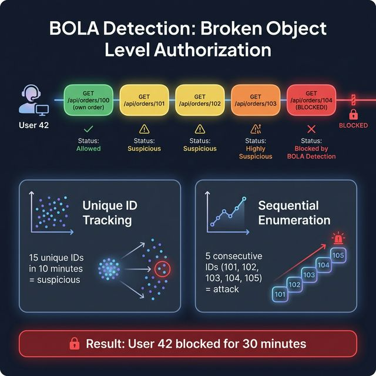

# 🚪 BOLA Detection

**Detects Broken Object Level Authorization — users accessing other users' data by changing IDs.**

## The Problem

OWASP API Security #1 vulnerability. A user with ID 42 calls `GET /api/orders/100` (their order). Then they call `/api/orders/101`, `/api/orders/102`, `/api/orders/103`... accessing other users' orders.

## How It Works



**Two detection strategies:**

| Strategy | What It Detects | Threshold |
|:---|:---|:---|
| Unique ID Tracking | User accessing too many different resource IDs | 15 unique IDs / 10 min |
| Sequential Enumeration | User accessing IDs in sequence (1, 2, 3, 4...) | 5 consecutive sequential IDs |

**Auto-detects resource IDs** in paths matching `/api/{resource}/{id}` — supports both numeric IDs and UUIDs.

## Integration

### Minimal
```yaml
sentinai:
  modules:
    bola-detection:
      enabled: true
```

### Custom Config
```yaml
sentinai:
  modules:
    bola-detection:
      enabled: true
      config:
        unique-id-threshold: 15
        sequential-threshold: 5
```

## Edge Cases Handled

| Scenario | How It's Handled |
|:---|:---|
| Admin accessing many records | Configure admin role exclusion |
| Public endpoints | Only tracks authenticated requests |
| UUIDs vs sequential IDs | Supports both — sequential detection only for numeric |
| Pagination (page=1, page=2) | Tracks path IDs, not query params |
| Shared resources | Threshold-based — accessing 5 shared items won't trigger |
