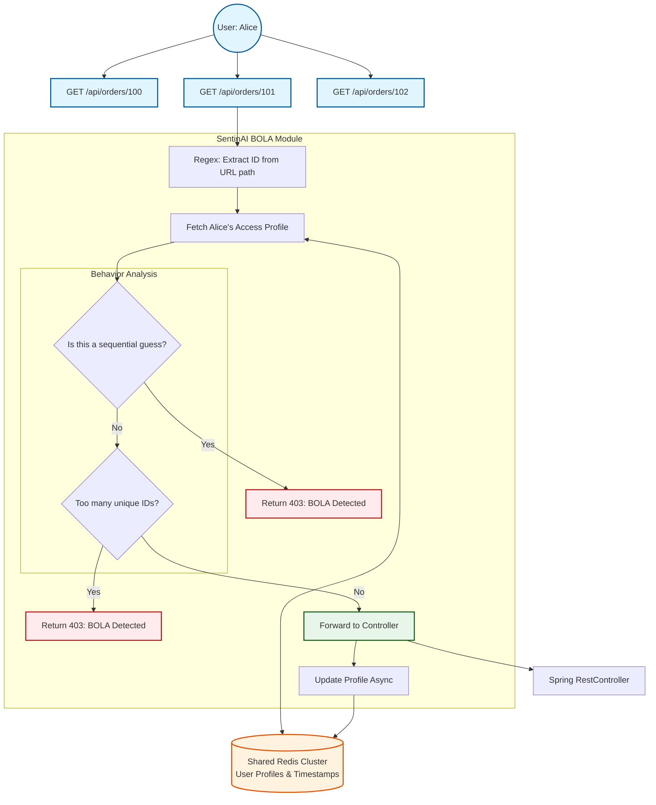

# 🚪 BOLA Detection

**Detects Broken Object Level Authorization (BOLA) attacks — also known as IDOR — where authenticated users try to access data that doesn't belong to them.**

---

## 🛑 The Problem: What Existed Before
Broken Object Level Authorization (BOLA) is the **#1 vulnerability** on the OWASP API Security Top 10 list. 

**Here's the problem:**
Imagine Alice logs into her account. The server authenticates her and gives her a valid Session cookie or JWT.
She clicks "My Orders" and her browser calls: `GET /api/orders/1042`.

Now, Alice gets curious. She opens Postman and changes the URL to `GET /api/orders/1043`. Then `1044`, `1045`...

Because Alice is currently authenticated, the API Gateway or WAF sees a perfectly valid, authorized request coming from a valid user. Unless the developer explicitly wrote an ownership check (`if (order.userId != currentUser.id) return 403;`) on every single endpoint, Alice just downloaded Bob and Charlie's orders. 

WAFs cannot stop BOLA because to a WAF, `GET /api/orders/1042` and `GET /api/orders/1043` look identical.

## 💡 The Solution: BOLA Detection
While developers *should* always write ownership checks, we all know things slip through the cracks. SentinAI acts as a safety net.

SentinAI's BOLA module sits inside the application and profiles normal user behavior. It tracks which resources a user is accessing, looking for two distinct attack patterns:
1. **Sequential Enumeration:** A user is rapidly guessing numeric IDs in sequence (e.g., `100`, `101`, `102`, `103`).
2. **Scattershot Access (Unique IDs):** A user suddenly requests an abnormally high number of *different* resource IDs (e.g., viewing 20 different users' profiles in 5 minutes).

---

## 🏗️ How It Works (Architecture)

The module intercepts every request, extracts resource IDs from the URL path, and updates the user's behavioral profile in the shared Redis cluster.



---

## ⚡ Detection Strategies & Thresholds

SentinAI automatically figures out if your API is using numeric IDs (`/api/users/5`) or UUIDs (`/api/users/a1b2c3d4...`) based on the URL path format.

| Strategy | What It Detects | Default Threshold |
|:---|:---|:---|
| **Sequential Enumeration** | An authenticated user accessing numeric IDs in sequence (`1, 2, 3, 4, 5...`). | 5 consecutive sequential IDs |
| **Unique ID Tracking** | A user accessing too many completely different resource IDs of the same type in a short window, regardless of whether they are sequential or completely random UUIDs. | 15 unique IDs / 10 minutes |

---

## 📦 Independent Installation

If you prefer a tight footprint and don't want the full `sentinai-spring-boot-starter`, you can install just the BOLA module:

```xml
<dependency>
    <groupId>io.github.tapeshchavle</groupId>
    <artifactId>sentinai-module-bola-detection</artifactId>
    <version>1.1.0</version>
</dependency>
```

---

## ⚙️ Configuration

### Minimal (Default)
```yaml
sentinai:
  modules:
    bola-detection:
      enabled: true
```

### Custom Tuning
You can adjust the thresholds to fit your specific application's normal usage patterns.
```yaml
sentinai:
  modules:
    bola-detection:
      enabled: true
      config:
        unique-id-threshold: 15     # Max 15 distinct IDs per 10 min window
        sequential-threshold: 5     # Max 5 consecutive ID guesses 
```

---

## 🛡️ Edge Cases Handled

| Scenario | How SentinAI Handles It |
|:---|:---|
| **Admins Accessing Many Records** | You can configure role exclusions so that users with the `ROLE_ADMIN` authority are bypassed and not tracked. |
| **Unauthenticated (Public) Endpoints** | The BOLA module totally ignores unauthenticated requests. It uses **enhanced identity resolution** (including Basic Auth decoding) to reliably track users across all protected endpoints. |
| **UUIDs vs Numeric IDs** | Sequential checking only runs if the IDs are numeric. But the *Unique ID Tracking* works perfectly on both numeric IDs and raw UUIDs, stopping scattershot data scrapers. |
| **Pagination (/api/orders?page=1)** | BOLA tracks path variables (the actual resource ID), it entirely ignores pagination parameters in the query string. |
| **Shared Resources (e.g., a Team Dashboard)** | Tracking is threshold-based. If a user normally views 5 shared documents a day, they won't trigger the 15-ID threshold. |
