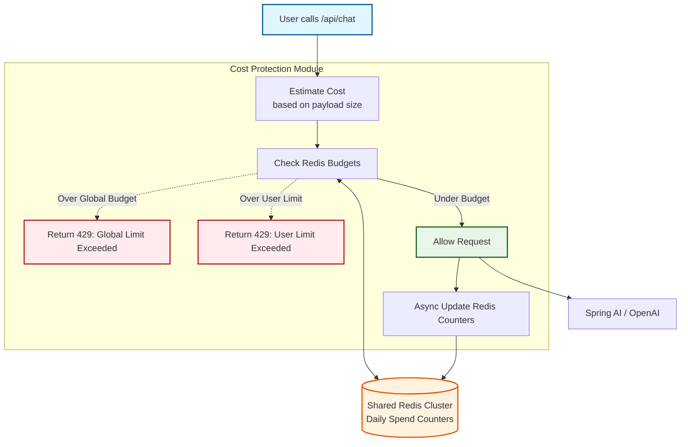

# 💰 Cost Protection

**Prevents AI API bill shock caused by malicious actors, leaked keys, or buggy frontends.**

---

## 🛑 The Problem: What Existed Before
Adding AI capabilities to your application usually means integrating with an LLM provider like OpenAI, Anthropic, or Nvidia. Unlike traditional APIs that have fixed infrastructure costs, AI APIs charge you *per token*. 

**Here's the problem:**
It only takes one malicious user writing a script, or one frontend infinite-loop bug, to send 100,000 requests to your `/api/chat` endpoint overnight. Because each of those requests triggers an outbound call to OpenAI, your application happily processes them.

You go to sleep thinking everything is fine. You wake up to a **$3,000 bill from OpenAI**.

Traditional rate limits (like 100 requests per minute) don't solve this. A user can still send 100 requests per minute *all day long* and run up a massive bill.

## 💡 The Solution: Cost Protection
The Cost Protection module acts as a strict financial accountant for your AI endpoints. 

It intercepts requests to anything that looks like an AI endpoint (e.g., `/chat`, `/generate`, `/summarize`) and keeps a running tally of estimated costs in your Redis cluster. It tracks both the explicit per-user spend and the global application spend. If a user hits their daily financial limit, they get cut off with a professional **429 Too Many Requests** status until midnight to stop the bleeding.

---

## 🏗️ How It Works (Architecture)

The module sits before your controller to intercept the prompt, estimates the cost, checks the budget in Redis, and then decides whether to forward the request to the LLM or block it.



---

## ⚡ The Financial Limits

The accountant operates with three distinct rules:

| Check | Default Limit | What Happens Documented |
|:---|:---|:---|
| **Global Daily Budget** | $50.00 / day | Throttles ALL AI requests across the entire application once this is hit. Serves as the ultimate fail-safe against bankruptcy. |
| **Early Warning Alert** | 80% of budget | Logs a `CRITICAL` warning to your monitoring tools. It doesn't block traffic yet, giving you time to jump in and increase the limit if it's a legitimate traffic spike. |
| **Per-User Limit** | 100 requests / day | Throttles *only* the specific user or IP that is abusing the endpoint. Everyone else continues normally. |

*Endpoints are auto-detected by path matching for things like `/chat`, `/summarize`, `/generate`, `/completion`.*

---

## 📦 Independent Installation

If you don't want the full `sentinai-spring-boot-starter`, you can include just the Cost Protection module:

```xml
<dependency>
    <groupId>io.github.tapeshchavle</groupId>
    <artifactId>sentinai-module-cost-protection</artifactId>
    <version>1.1.0</version>
</dependency>
```

---

## ⚙️ Configuration

### Minimal (Default)
```yaml
sentinai:
  modules:
    cost-protection:
      enabled: true
      config:
        daily-limit: 50     # Caps global spending at $50/day
```

### Advanced Budgeting
You can aggressively tailor the limits and the assumed cost per request depending on which LLM you are using (e.g., GPT-4 is more expensive than GPT-3.5).
```yaml
sentinai:
  modules:
    cost-protection:
      enabled: true
      config:
        daily-limit: 100            # Global budget: $100/day
        per-user-limit: 200         # Max 200 calls per individual user
        cost-per-request: 0.005     # Estimated combined prompt/completion cost
        alert-threshold: 0.75       # Fire an admin alert at 75% budget used
```

---

## 🛡️ Edge Cases Handled

| Scenario | How SentinAI Handles It |
|:---|:---|
| **Midnight Rollover** | Using Redis TTLs, the financial counters automatically expire and reset to $0 at midnight system time. |
| **Unauthenticated / Anonymous Users** | If the request doesn't have a `userId` (e.g., a public demo), the module uses **enhanced identity resolution** (including Basic Auth decoding) to identify the user, or falls back to tracking against their IP address. |
| **Viral Launch Day (Legitimate Spike)** | The 80% Early Warning alert fires first. If you monitor your logs, you'll see the alert and can raise the `daily-limit` via configuration before any real users are blocked at 100%. |
| **Different AI Models** | Simply adjust the `cost-per-request` configuration to reflect your specific model's blended token costs. |
