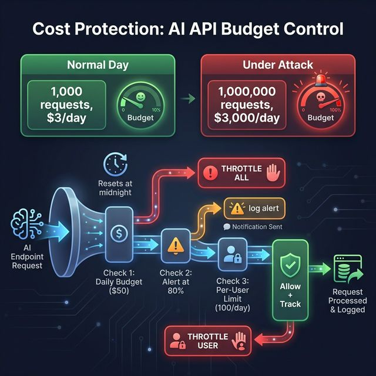

# 💰 Cost Protection

**Prevents AI API bill shock from abuse, leaked keys, or buggy clients.**

## The Problem

Your AI-powered app uses OpenAI/Kimi at $0.003 per call. A bot discovers your `/api/chat` endpoint and sends 1 million requests overnight. **Morning bill: $3,000.**

## How It Works



**Three checks:**

| Check | Default | What Happens |
|:---|:---|:---|
| Global daily budget | $50/day | Throttles ALL AI requests when exceeded |
| Alert threshold | 80% of budget | Logs warning — no blocking |
| Per-user limit | 100 calls/user/day | Throttles only that user |

**Auto-detects AI endpoints** by path: `/chat`, `/summarize`, `/generate`, `/ai/`, `/completion`, `/predict`.

## Independent Installation

If you don't want the full `sentinai-spring-boot-starter`, you can include just this module:

```xml
<dependency>
    <groupId>io.github.tapeshchavle</groupId>
    <artifactId>sentinai-module-cost-protection</artifactId>
    <version>1.0.0</version>
</dependency>
```

## Integration

### Minimal
```yaml
sentinai:
  modules:
    cost-protection:
      enabled: true
      config:
        daily-limit: 50     # $50/day
```

### Custom Config
```yaml
sentinai:
  modules:
    cost-protection:
      enabled: true
      config:
        daily-limit: 100
        per-user-limit: 200
        cost-per-request: 0.005
        alert-threshold: 0.75   # Alert at 75%
```

## Edge Cases Handled

| Scenario | How It's Handled |
|:---|:---|
| Day boundary | Counter resets at midnight automatically |
| Anonymous users | Tracked by IP instead of userId |
| Legitimate burst | Alert fires first (80%), block only at 100% |
| Multiple AI models | Configure `cost-per-request` for your specific model |
