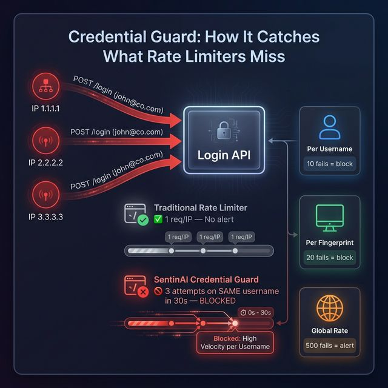

# 🔑 Credential Guard

**Detects slow-burn credential stuffing and brute-force attacks that bypass traditional rate limiters.**

## The Problem

Attackers cycle through thousands of IPs with 1-2 login attempts each. Per-IP rate limits see nothing. Meanwhile, account `john@company.com` gets hit 10,000 times across 5,000 different IPs.

## How It Works



**Three tracking dimensions** (not just IP):

| Dimension | What It Tracks | Default Threshold |
|:---|:---|:---|
| Per-Username | Failed logins targeting the same account | 10 failures / 5 min |
| Per-Fingerprint | Same browser signature across IPs | 20 failures / 5 min |
| Global Rate | Total failure spike (may indicate system issue) | 500 failures / 5 min |

**Auto-detection** — Recognizes login endpoints by path: `/login`, `/auth`, `/signin`, `/token`, `/authenticate`.

## Independent Installation

If you don't want the full `sentinai-spring-boot-starter`, you can include just this module:

```xml
<dependency>
    <groupId>io.github.tapeshchavle</groupId>
    <artifactId>sentinai-module-credential-guard</artifactId>
    <version>1.0.0</version>
</dependency>
```

## Integration

### Minimal (zero config)
```yaml
sentinai:
  ai:
    api-key: ${AI_API_KEY}
# Credential Guard auto-enables and monitors all login-like endpoints
```

### Custom Config
```yaml
sentinai:
  modules:
    credential-guard:
      enabled: true
      config:
        per-username-failures: 10
        global-failure-spike: 500
```

## Edge Cases Handled

| Scenario | How It's Handled |
|:---|:---|
| IP rotation (5,000 IPs) | Tracks by **target username**, not by source IP |
| Distributed botnet | Fingerprint grouping detects same browser across IPs |
| Legitimate password reset | Single failure doesn't trigger — needs threshold breach |
| Global spike (system issue) | Logged as suspicious, not blocked (could be a deployment bug) |
