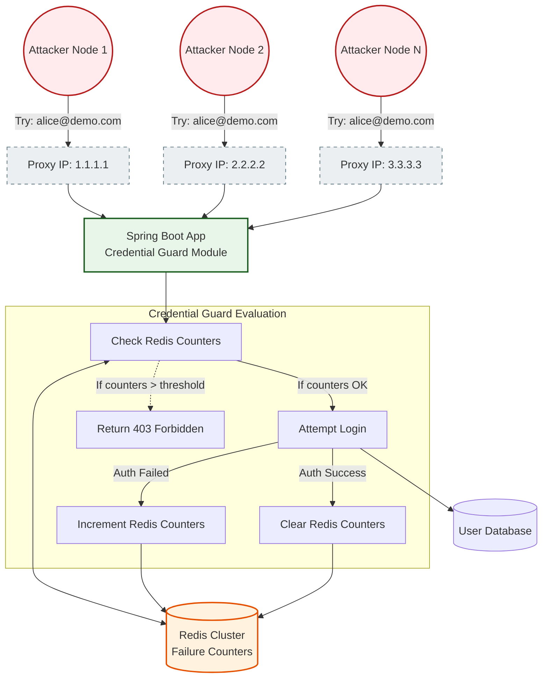

# 🔑 Credential Guard

**Detects slow-burn credential stuffing and brute-force attacks that easily bypass traditional IP rate limiters.**

---

## 🛑 The Problem: What Existed Before
Traditional rate limiters are almost entirely IP-based. For example, a standard WAF rule might say: *"Block any IP that fails to login 5 times in 1 minute."*

**Here's the problem:**
Modern attackers don't try 10,000 passwords from a single IP address. They use vast proxy networks or botnets containing thousands of different IP addresses. 

They will try logging into `alice@company.com` 5,000 times, but each attempt comes from a *different* IP address. To your standard WAF or gateway, every single IP has only failed once. The IP rate limiter never triggers, and the attacker eventually guesses Alice's password.

## 💡 The Solution: Credential Guard
Instead of just counting failures per IP, SentinAI's Credential Guard tracks failures across multiple dimensions simultaneously:
1. **Per-Username:** It tracks how many times *anyone*, from *any* IP, has failed to log into a specific account (e.g., `alice@company.com`).
2. **Per-Fingerprint:** It tracks how many failures are coming from the same browser/device fingerprint, even if the IP address keeps changing.
3. **Global Spike:** It monitors the overall failure rate across the entire application to detect massive botnet activity.

---

## 🏗️ How It Works (Architecture)

Credential Guard intercepts traffic at your login endpoints (auto-detected via paths like `/login`, `/auth`, `/signin`) and tracks failures using a rolling window in your shared Redis cluster.


*Note: Because the counters are stored in a distributed Redis cluster, if `Proxy 1` hits Instance A, and `Proxy 2` hits Instance B, both instances are updating and reading the exact same failure counter for `alice@demo.com`.*

---

## ⚡ Default Thresholds

| Tracking Dimension | What It Tracks | Default Threshold |
|:---|:---|:---|
| **Per-Username** | Failed logins targeting the exact same account | 10 failures / 5 min |
| **Per-Fingerprint**| Failed logins from the same browser signature | 20 failures / 5 min |
| **Global Rate** | Total failure spike across the whole app | 500 failures / 5 min |

---

## 📦 Independent Installation

If you prefer to keep your dependencies light and don't want the full `sentinai-spring-boot-starter`, you can install just this module:

```xml
<dependency>
    <groupId>io.github.tapeshchavle</groupId>
    <artifactId>sentinai-module-credential-guard</artifactId>
    <version>1.0.0</version>
</dependency>
```

---

## ⚙️ Configuration

### Minimal (Zero Config)
If you are using the starter, Credential Guard is enabled by default with sensible limits.
```yaml
sentinai:
  ai:
    api-key: ${AI_API_KEY}
# Credential Guard auto-enables and monitors all login-like endpoints
```

### Custom Limits
If you want to tighten or loosen the thresholds, simply adjust them in your `application.yml`:
```yaml
sentinai:
  modules:
    credential-guard:
      enabled: true
      config:
        per-username-failures: 5   # Lock down an account faster
        global-failure-spike: 1000 # Allow more global noise
```

---

## 🛡️ Edge Cases Handled

| Scenario | How SentinAI Handles It |
|:---|:---|
| **IP rotation (Proxy Networks)** | It tracks by **target username**, meaning changing IPs doesn't reset the counter. |
| **Distributed Botnet** | The browser fingerprint grouping detects the same bot tool being used across multiple IPs. |
| **Legitimate User Forgetting Password** | A single or double failure doesn't trigger a lock. Only breaching the threshold (e.g., 10 times in 5 mins) triggers a block. |
| **Global System Outage** | If the DB goes down and *everyone* fails to login, this triggers the Global Spike monitor. It is logged as highly suspicious but won't permanently block IPs (which helps avoid self-inflicted Denial of Service). |
