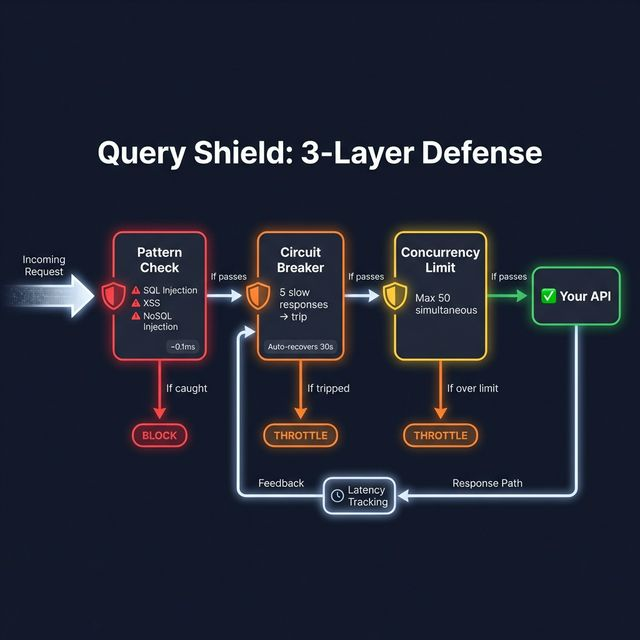

# 🛡️ Query Shield

**Protects against application-layer DDoS via expensive queries, SQL injection, and wildcard abuse.**

## The Problem

Attackers send valid-looking requests that trigger expensive database operations. Rate limits don't help — each request is "valid" but costs 10 seconds of CPU.

```
GET /api/search?q=%25%25%25%25%25%25   →  SELECT * FROM products WHERE name LIKE '%%%%%%'
GET /api/users?filter=*                →  Full table scan on 10M rows
POST /api/graphql { "query": "{ users { orders { items { reviews }}}}" }  →  N+1 explosion
```

## How It Works



**Three layers of defense:**

| Layer | Speed | What It Does |
|:---|:---|:---|
| Pattern Check | ~0.1ms | 8 regex patterns: SQL injection, XSS, NoSQL injection, wildcard abuse |
| Circuit Breaker | ~0ms | Trips after 5 consecutive slow responses (>3s). Auto-recovers in 30s |
| Concurrency Limiter | ~0ms | Max 50 simultaneous requests per endpoint |

### Patterns Detected

```
' OR '1'=1          →  SQL injection
UNION SELECT         →  SQL data extraction
SLEEP(10)           →  Time-based blind injection
$where              →  NoSQL injection
DROP TABLE          →  DDL injection
<script>            →  XSS
javascript:         →  Protocol-based XSS
eval(               →  Code injection
```

## Integration

### Minimal
```yaml
sentinai:
  ai:
    api-key: ${AI_API_KEY}
# Query Shield auto-enables and protects all endpoints
```

### Custom Config
```yaml
sentinai:
  modules:
    query-shield:
      enabled: true
      config:
        max-concurrency: 50
        circuit-breaker-threshold: 5
        slow-response-ms: 3000
```

## Edge Cases Handled

| Scenario | How It's Handled |
|:---|:---|
| Legitimate traffic spike | Concurrency limit + circuit breaker (not blocking) |
| Normal search terms | Pattern matching is precise — `SELECT` in text won't trigger |
| First expensive query | Circuit breaker starts half-open, trips after threshold |
| Multiple slow endpoints | Each endpoint has its own circuit breaker state |
