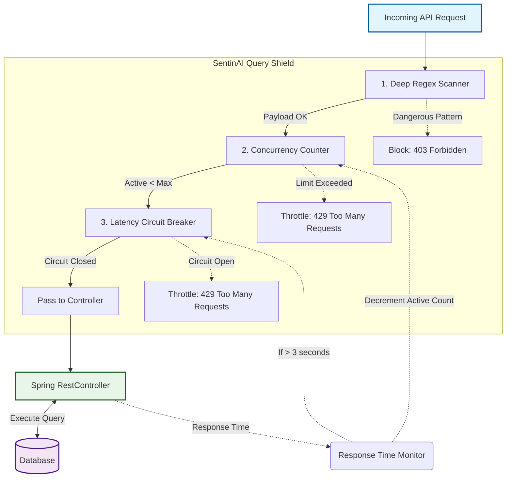

# 🛡️ Query Shield

**Protects against application-layer DDoS via expensive queries, SQL injection, and wildcard abuse.**

---

## 🛑 The Problem: What Existed Before
When we think of DDoS attacks, we usually picture massive botnets flooding a server with millions of garbage packets. Cloudflare and AWS Shield are great at stopping those volumetric attacks.

**Here's the problem they can't solve:**
What happens when an attacker sends perfectly valid JSON, but the payload contains instructions that make your database do a massive amount of work?

```
GET /api/search?q=%25%25%25%25%25%25 
(Translates to: SELECT * FROM products WHERE name LIKE '%%%%%%')

POST /api/graphql 
{ "query": "{ users { orders { items { reviews }}}}" }
```

A standard rate limiter might allow 100 requests per second. But 100 of *these* requests per second? Your database CPU will spike to 100%, connections will be exhausted, and the entire application will crash. This is an **Application-Layer DDoS**.

## 💡 The Solution: Query Shield
Query Shield sits inside your application and actively monitors how much strain the application is under *right now*. 
It doesn't just look at rate; it looks at **concurrency** and **latency**, combined with deep payload inspection.

1. **Pattern Check (Synchronous):** Instantly drops known malicious payloads (SQLi, XSS, wildcards).
2. **Concurrency Limiter:** Caps the maximum number of *simultaneous* requests a specific endpoint is allowed to handle at one time.
3. **Circuit Breaker:** If an endpoint starts responding too slowly (indicating the database is struggling), it trips the breaker and fast-fails new requests until the DB recovers.

---

## 🏗️ How It Works (Architecture)

Query Shield operates sequentially. The pattern check happens immediately. If the payload is safe, it checks if there are too many concurrent requests to the endpoint. Finally, it monitors how long the database takes to respond.



---

## ⚡ The Defense Layers

| Layer | Speed to Evaluate | What It Does |
|:---|:---|:---|
| **Pattern Check** | ~0.1ms | Scans the query string and body for 8 patterns: SQL injection, XSS, NoSQL injection (`$where`), and massive wildcard abuse. It automatically performs **URL-decoding** on query parameters to detect obfuscated attacks. |
| **Circuit Breaker** | ~0ms | Tracks how long the Controller takes to return. If 5 consecutive requests take >3 seconds, it trips. It automatically tries admitting a request again after 30 seconds. |
| **Concurrency Limiter**| ~0ms | Keeps an atomic counter of active requests per endpoint. Default max: 50 *simultaneous* connections per path. |

---

## 📦 Independent Installation

If you prefer a lightweight footprint and don't want the full `sentinai-spring-boot-starter`, you can install just the Query Shield module:

```xml
<dependency>
    <groupId>io.github.tapeshchavle</groupId>
    <artifactId>sentinai-module-query-shield</artifactId>
    <version>1.1.0</version>
</dependency>
```

---

## ⚙️ Configuration

### Minimal (Zero Config)
If you are using the starter, Query Shield is automatically enabled for all endpoints.
```yaml
sentinai:
  ai:
    api-key: ${AI_API_KEY}
```

### Custom Thresholds
You can tweak the concurrency limits and circuit breaker sensitivities specifically to match your database capacity.
```yaml
sentinai:
  modules:
    query-shield:
      enabled: true
      config:
        max-concurrency: 50
        circuit-breaker-threshold: 5
        slow-response-ms: 3000
```

---

## 🛡️ Edge Cases Handled

| Scenario | How SentinAI Handles It |
|:---|:---|
| **Legitimate Traffic Spike** | It will hit the concurrency limit or circuit breaker and return `429 Too Many Requests`. The backend DB stays alive, and normal traffic resumes once the spike clears. |
| **Normal Search Terms** | The regex patterns are precise. Searching for the word `SELECT` or `DROP` in a normal text field will not trigger the SQLi blocks. |
| **A Single Anomalous Slow Query** | The circuit breaker requires a *streak* of failures (default 5 consecutive slow queries) before tripping, preventing a single blip from taking down an endpoint. |
| **Multiple Microservices** | The concurrency rules are calculated *per endpoint URI* (`/api/users` vs `/api/products`), meaning a slow products table won't bring down your user login endpoint. |
